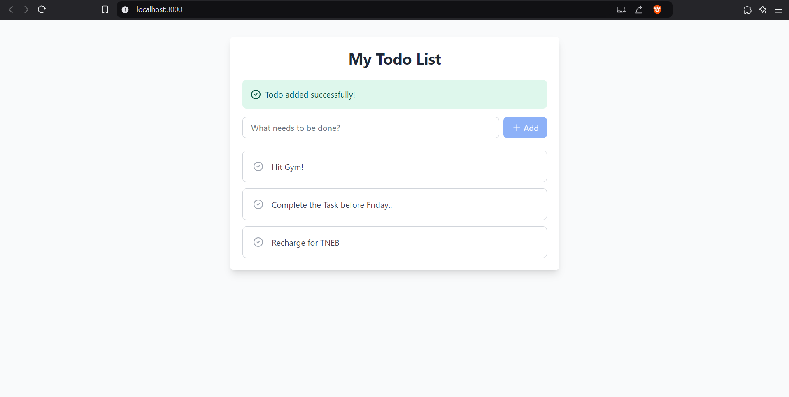
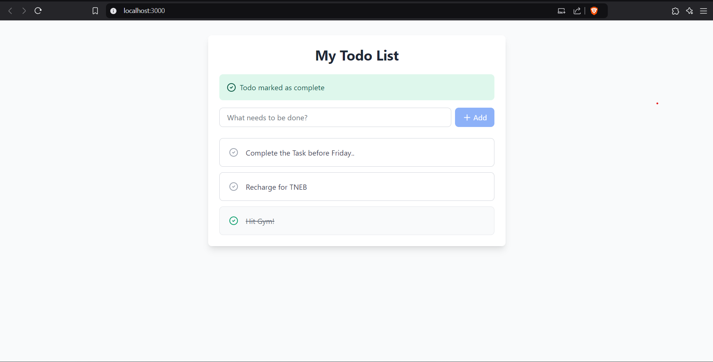
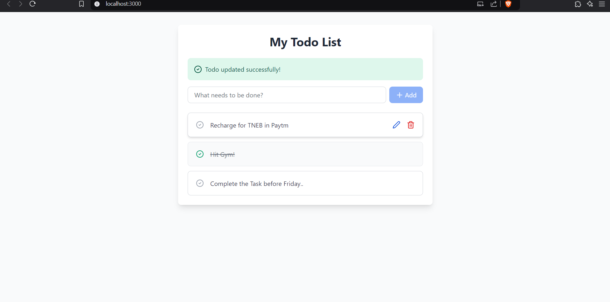
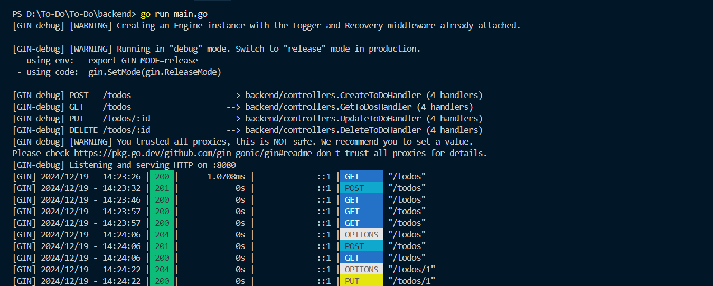

# 📝 To-Do Application

A simple and interactive To-Do application with a backend built in Golang (Gin) and a frontend built with React. It allows users to add, update, and delete tasks, as well as view them in real-time.
### Data Storage
- **In-memory Data Store**:
  - All data is temporarily stored in the **server's memory** rather than in a database
  - Suitable for **development** or **small-scale applications**
  - **Data Loss**: Data will be lost when the server is restarted

### Communication
- The application uses **HTTP**:
  - **HTTP** is a standard protocol for transmitting data over the web
  - Ensures seamless interaction between the **frontend** and **backend**

## ✨ Features

- 📦 List all tasks with detailed information
- 🖊️ Add new tasks
- ✏️ Edit existing tasks
- ❌ Delete tasks


## 🚀 Tech Stack

- **Frontend**: React, Tailwind CSS
- **Backend**: Golang (Gin)


## 📸 Project Screenshots

### Adding a Task

*Add task operation of the To-Do application*

### Task Status

*Marking a Task to be Completed*

### Edit Task

*Task editing interface with fields to modify task details*

### Backend Terminal 

*Backend indicator of using Gin for development*

## 📋 Prerequisites

Before you begin, ensure you have the following installed:
- Node.js (v14 or higher)
- Go (v1.16 or higher)
- Git

## 🛠️ Installation & Setup

1. **Clone the repository**
```bash
git clone https://github.com/Ragulprince/To-Do
cd todo-application
Setup Backend
bash
Copy code
cd backend


# Install Go dependencies
go mod tidy

# Run the server 
 go run main.go 
 
# Setup Frontend
cd frontend

# Install dependencies
npm install

# Start development server
npm start

📁 Project Structure
todo-application/
├── frontend/                 # React frontend application
│   ├── src/
│   │   ├── components/      # React components
│   │   │   ├──Todo.js
│   │   └── App.js           # Main application component
│   └── public/              # Static files
│
└── backend/                 # Golang backend server
    ├── controllers/         # Request handlers
    ├── models/              # Database models
    ├── routes/              # API routes
    └── main.go              # Entry point

🌐 API Endpoints
GET /api/tasks - Get all tasks
GET /api/tasks/:id - Get specific task details
POST /api/tasks - Create a new task
PUT /api/tasks/:id - Update a task
DELETE /api/tasks/:id - Delete a task


Frontend Configuration
Tailwind configuration can be modified in tailwind.config.js

🤝 Contributing
Fork the repository
Create your feature branch (git checkout -b feature/AmazingFeature)
Commit your changes (git commit -m 'Add some AmazingFeature')
Push to the branch (git push origin feature/AmazingFeature)
Open a Pull Request
👥 Authors
Ragul - Initial work
